# LedgerLens

LedgerLens checks a month of a business's GST records against each other, tells you in rupees what every mismatch costs, shows the evidence, and drafts the fix for you to approve.

Built for Fintechstico V7.0 (NSUT Consilium'26), problem statement 2.

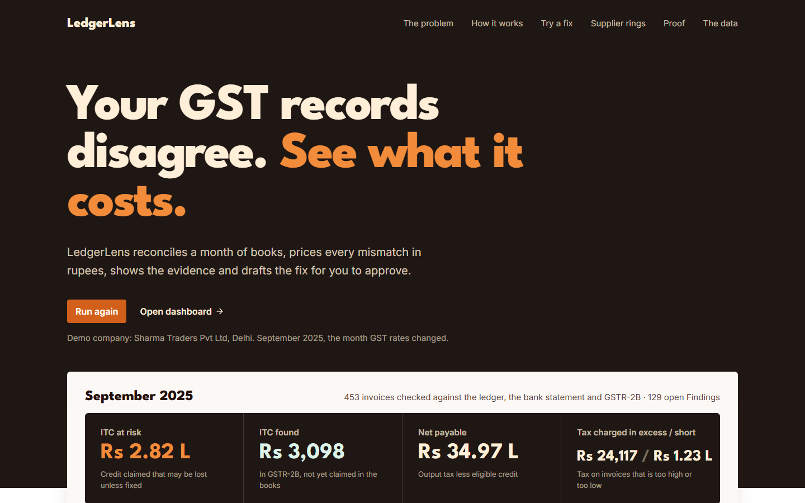

## The problem, in the organisers' words

> Build an AI-driven tax reconciliation system that analyzes invoices, transactions, accounting records, and tax data to identify discrepancies, errors, and potential compliance issues. The system should go beyond basic matching.

## The problem, in plain words

Every month an Indian business has four records of the same purchases and sales:

| Record | What it says | In the demo month |
|---|---|---|
| Invoices | What was bought and sold, and the tax on each | 453 |
| Ledger entries | What the accountant entered in the books | 898 |
| Bank lines | What was actually paid and received | 453 |
| GSTR-2B lines | What the suppliers reported to the GST portal | 156 |

These four rarely agree. A supplier forgets to report an invoice. A number is typed wrongly. An invoice is entered twice. A tax rate changed last week and the old one was used.

Each disagreement costs money. A business can subtract the GST it paid on purchases from the GST it owes on sales. That is called input tax credit (ITC). If a record is wrong, that credit can be lost, or the business pays more tax than it should.

For the demo company, in September 2025, the disagreements put Rs 2,81,615 of credit at risk.

## What LedgerLens does

One click reconciles the month. It takes about 9 seconds and shows the real records as it works through them.

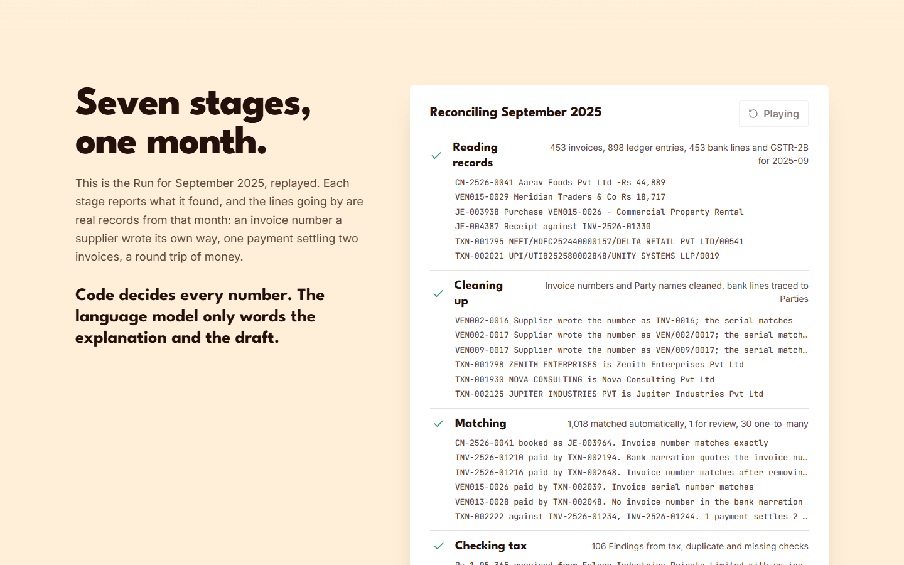

Then it shows the result, with the money first.

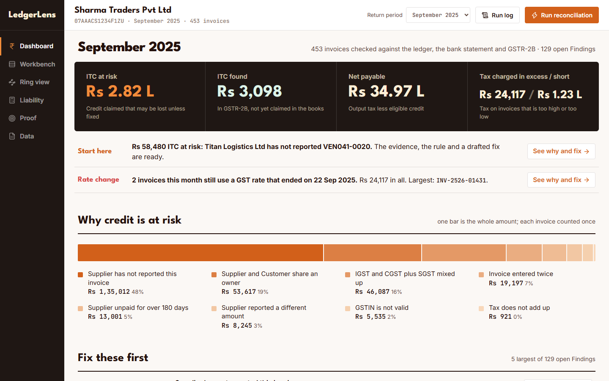

The four numbers at the top are what the month costs:

- ITC at risk, Rs 2.82 lakh: credit the business claimed that may be lost unless something is fixed.
- ITC found, Rs 3,098: credit the suppliers reported that the business has not claimed yet.
- Net payable, Rs 34.97 lakh: the tax to pay for the month.
- Tax charged in excess or short: invoices where the tax is too high or too low.

Below them, one bar shows why the credit is at risk, and a short list says what to fix first.

## What makes it different

1. Rupees first. Every problem is priced. You see what it costs before you see anything else.
2. Evidence for every Finding. Each one shows the record, what it should be, and the rule, in plain words.
3. A fix you approve. LedgerLens drafts the email, credit note or ledger entry. Nothing leaves without your approval.
4. It looks across everyone you trade with, and catches a supplier and a customer that have the same owner.
5. Measured, not claimed. The demo data has mistakes planted on purpose, so what was caught and what was missed can be counted.

Code decides every number. The language model only words the explanation and the draft.

## One Finding, start to finish

In September 2025 a GST rate changed on the 22nd. Three days later, invoice INV-2526-01431 was still charged at the old rate, 28 percent, when the rate was 18 percent.

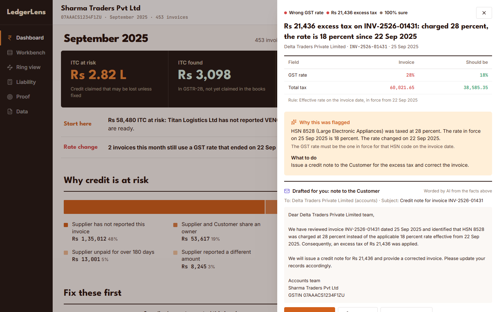

On the left is what the invoice says. On the right is what it should be. Below that is the reason in plain words, and a credit note already drafted to the customer.

Approve the draft and the month's numbers move: excess tax falls from Rs 24,117 to Rs 2,681.

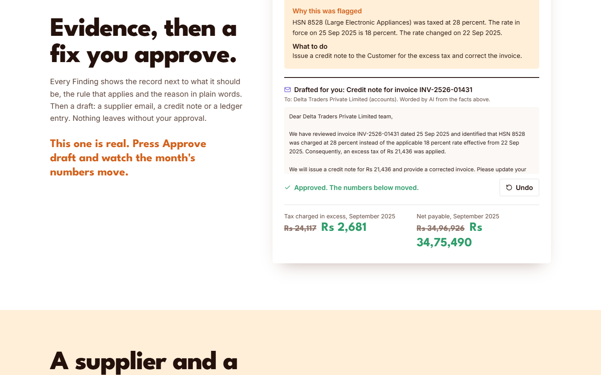

## A supplier and a customer with one owner

LedgerLens draws everyone the company trades with. In the demo month two of them are red: Unity Infra Pvt Ltd, a supplier, and Unity Motors Ltd, a customer, are registered under the same PAN. One owner sits on both sides of the books.

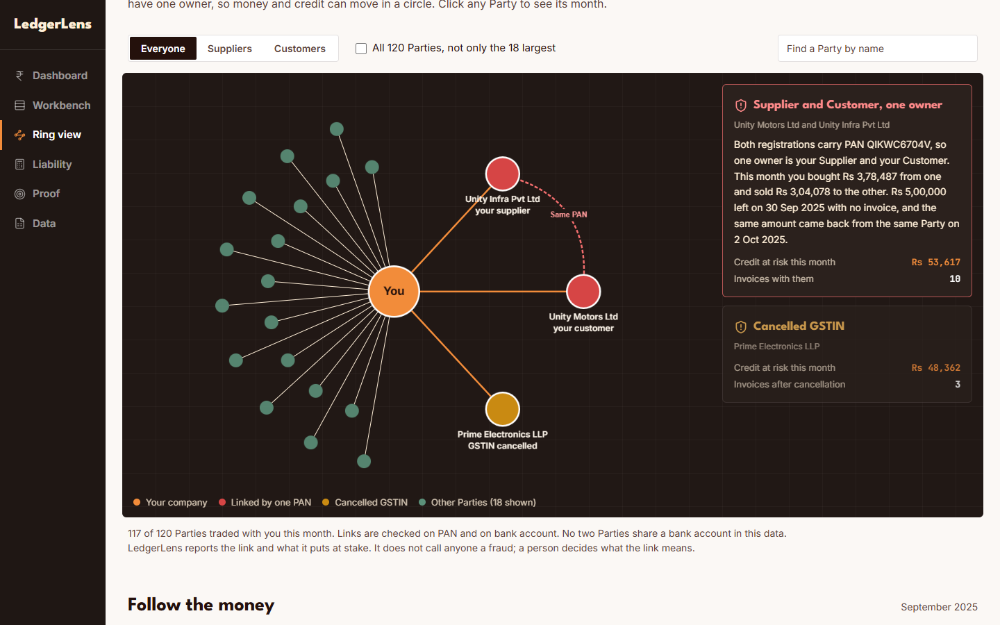

It then follows the money. The company bought from one and sold to the other, and Rs 5,00,000 went out on 30 Sep 2025 with no invoice and came back on 2 Oct 2025.

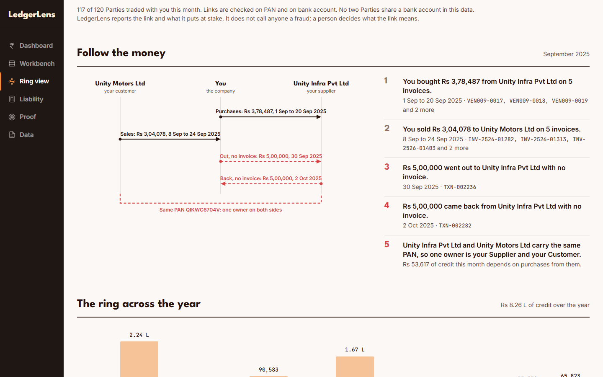

LedgerLens reports the link and what it puts at stake (Rs 53,617 of credit that month). It does not call anyone a fraud. A person decides what the link means.

## What the organisers asked for, and what LedgerLens does

The problem statement lists seven things the system should provide. Each is quoted below.

| The statement asks for | What LedgerLens does | Where to see it |
|---|---|---|
| "Transaction reconciliation to match invoices, payments, and accounting records." | Matches each invoice to its ledger entry, its bank payment and, for purchases, the supplier's GSTR-2B line. One payment that settles several invoices is recognised and left alone. In September: 1,065 matches, 98.4 percent needed no one. | Dashboard, How the month matched. Workbench, Matches. |
| "Mismatch & duplicate detection for differences in amounts, dates, invoice IDs, tax values, and repeated records." | Reports amounts that differ, entries booked in a different month, invoice numbers typed differently, and anything entered, booked or paid twice. | Workbench |
| "Tax verification by comparing recorded tax amounts with expected tax based on applicable rates." | Checks each invoice against the rate in force on its date (including the change of 22 Sep 2025), whether the right kind of GST was charged, and whether the tax adds up. | Finding detail |
| "Missing & unmatched transaction detection to identify incomplete or unaccounted financial records." | Reports invoices never booked, bookings with no invoice, payments that are not in the bank, bank entries with no invoice, and purchases the supplier has not reported. | Workbench, Missing |
| "Anomaly detection to flag unusual transaction and tax patterns." | Reports invoices far larger than usual, large invoices dated on a Sunday, bursts of small invoices, large round amounts, and purchases split to stay under an approval limit. Each one says why it looked unusual. It also finds linked suppliers and customers. These are rules, not a trained model. | Workbench, Anomaly. Ring view. |
| "Tax liability analysis to estimate tax obligations from reconciled financial records." | Works out what the month should cost, by type of GST, and compares it with the return that was filed. In September the return declared Rs 32.15 lakh; LedgerLens works out Rs 34.97 lakh. | Liability |
| "Reconciliation dashboard to visualize matched, unmatched, duplicate, and discrepant transactions." | The dashboard shows the money, the causes, what matched, and the Findings by kind. The workbench lists every Finding and every match. | Dashboard, Workbench |

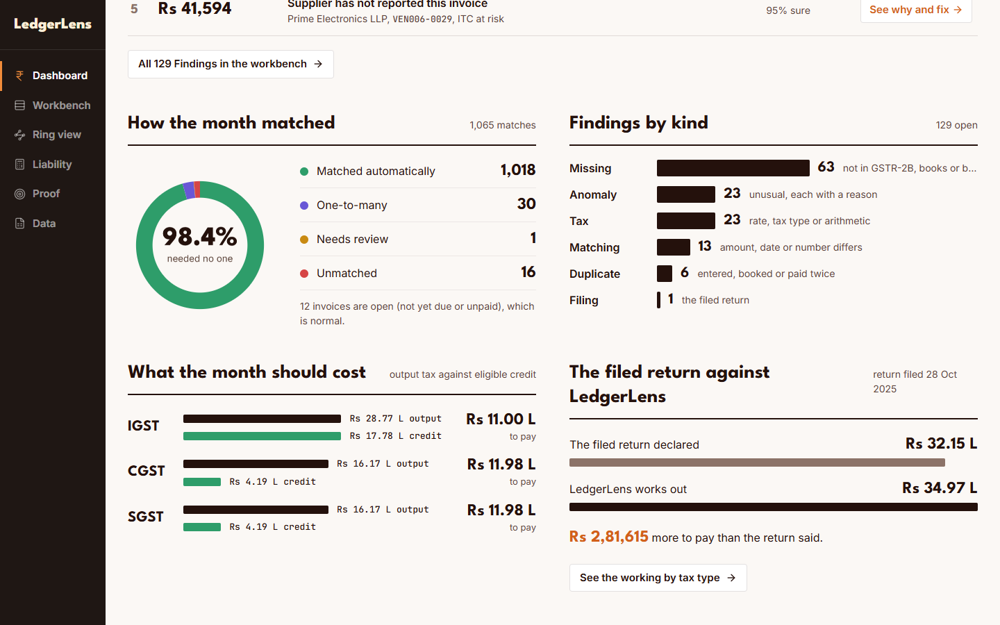

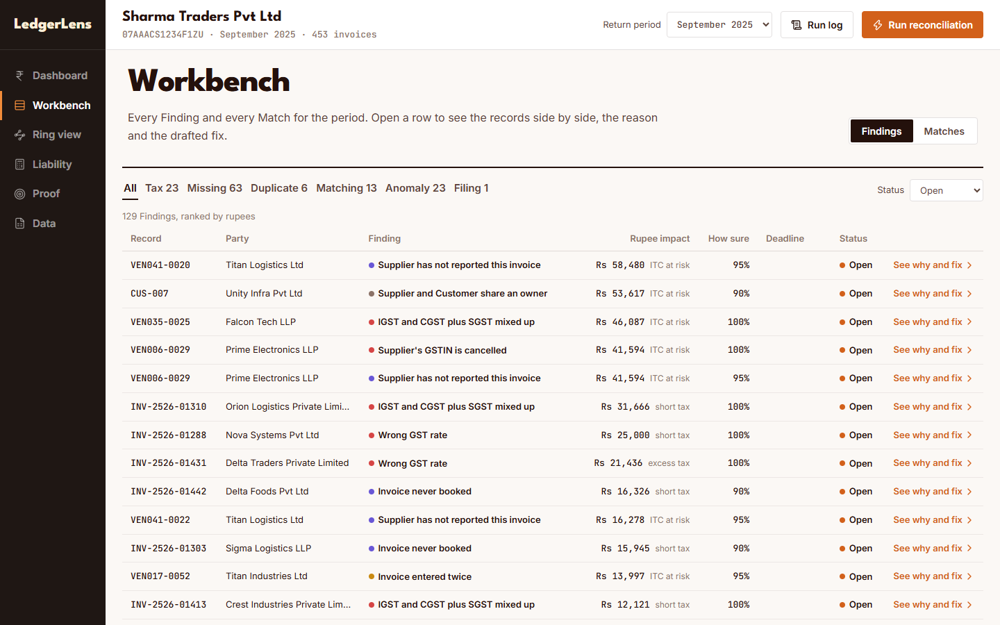

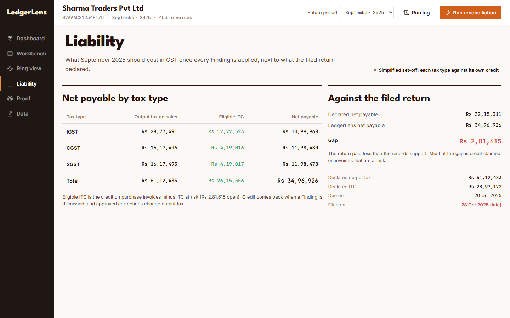

## How we know it works

The problem statement says:

> Teams must generate a synthetic financial dataset containing invoices, transactions, tax rates, tax amounts, accounting records, and intentionally introduced discrepancies.

The demo data is one made-up company, a trader in Delhi, for one year (April 2025 to March 2026). Mistakes are planted in it on purpose, and there is a list of every one. That list is how the results are counted.

The two matchers learn from the earlier months. February and March 2026 are kept aside and never used for training. On those two months LedgerLens caught 287 of 288 planted mistakes (99.7 percent), with 8 false alarms. The Proof page lists every miss by record and has a switch for the whole year.

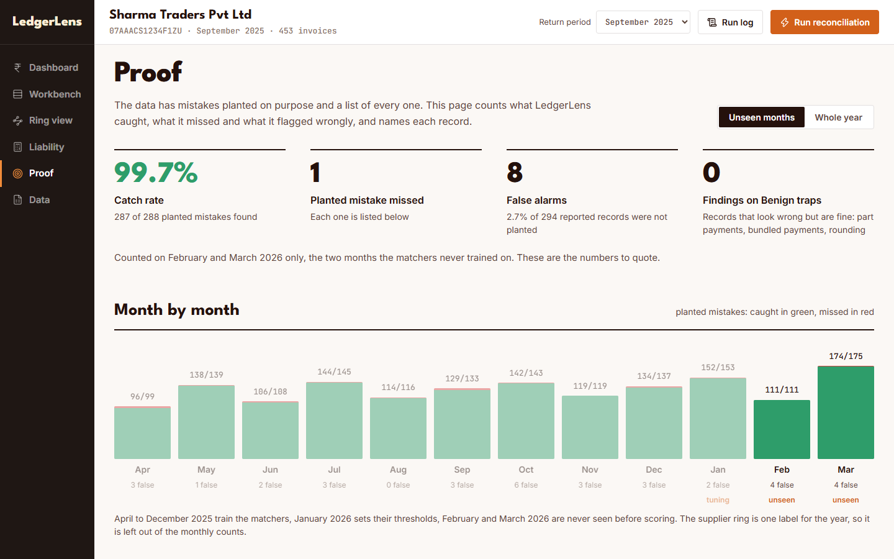

The Data page shows what was planted and lets you look up any record yourself.

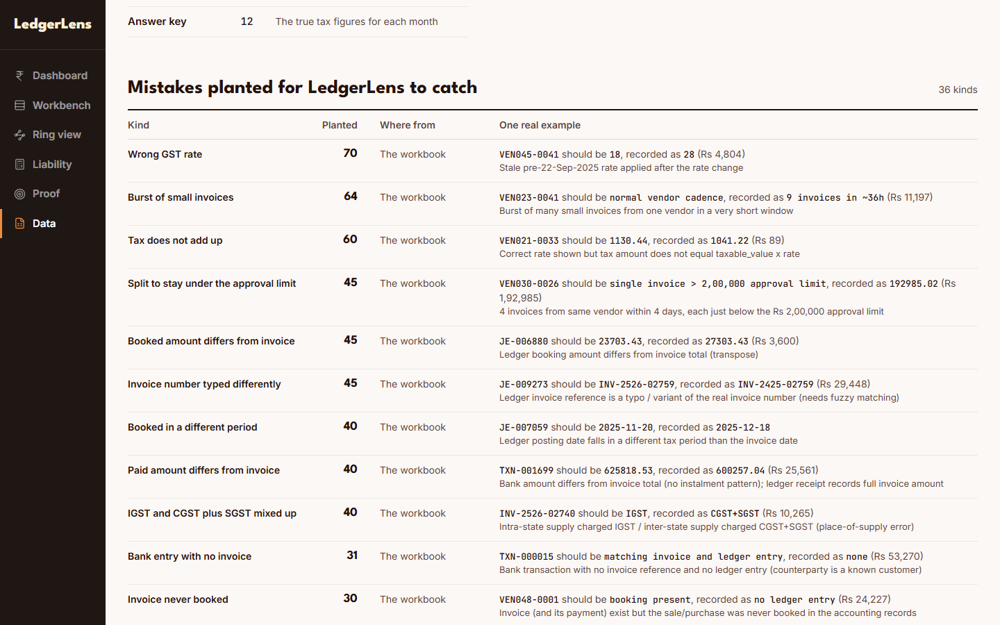

Synthetic data is cleaner than real books. These numbers show the method works. They do not say what it will score on a real company.

## A few terms

| Term | Meaning |
|---|---|
| GSTIN | A business's 15-character GST registration number. |
| PAN | The holder's 10-character tax identifier. It is part of the GSTIN, so two registrations with the same PAN have one owner. |
| GSTR-2B | The statement of what a business's suppliers reported against its GSTIN for a month. |
| ITC (input tax credit) | GST paid on purchases that a business may subtract from the GST it owes on sales. |
| ITC at risk | Credit the business claimed that may be lost unless something is fixed, in rupees. |
| ITC found | Credit that appears in GSTR-2B but is missing from the books, in rupees. |
| Net payable | The tax on sales minus the eligible credit for the month. |
| Run | One reconciliation of all records for a month. |
| Finding | One problem LedgerLens reports, with its rupee impact, the reason and a suggested fix. |
| Draft | A proposed next step for a Finding, written for a person to approve. |

The full vocabulary is in CONTEXT.md.

## How it is built

- Two trained matchers (invoice to ledger, invoice to bank) written in Python with scikit-learn. Everything else is rules.
- A FastAPI backend with the rules, the money maths and a SQLite database.
- A Next.js web app.
- Explanations and drafts are worded by a language model through Groq. The demo month is cached, so it runs with no network.

| Folder | What it holds |
|---|---|
| ml | Data loading, GSTR-2B generation, the two trained matchers |
| backend | FastAPI app: the rules engine, the money maths, the SQLite store, Drafts |
| frontend | Next.js app: start page, dashboard, workbench, ring view, liability, proof, data |
| docs | The demo script, the problem statement and the images on this page |
| data | The dataset and the generated GSTR-2B lines |
| plan, CONTEXT.md, ML_BUILD.md | The design documents |
| deck | The ideathon deck |

## Run it on a laptop (Windows)

Needs Python 3.10, Node 20 or newer and pnpm.

One time:

```
python -m venv backend\.venv
backend\.venv\Scripts\python -m pip install -r backend\requirements.txt
backend\.venv\Scripts\python -m pip install -e ml
pnpm --dir frontend install
pnpm --dir frontend build
cd backend
.venv\Scripts\python -m app.warm
cd ..
```

The last step loads the demo data and runs the analysis once (about 30 seconds), so the app is fast afterwards.

Every time: double-click start.cmd. It starts the API on port 8000 and the web app on port 3000 and opens the browser.

Drafts are worded by a language model through Groq. Put the key in backend/.env as GROQ_API_KEY=... and LLM_MODE=live. Without a key the app uses the cached Drafts in backend/cache/drafts and plain templates. The demo month is already cached, so it runs with no network.

## Tests

```
ml\.venv\Scripts\python -m pytest ml\tests -q
backend\.venv\Scripts\python -m pytest backend\tests -q
pnpm --dir frontend typecheck
pnpm --dir frontend lint
backend\.venv\Scripts\python backend\scripts\check_engine.py
```

The last command prints how many planted errors the engine catches, per Finding type, over the whole year.

## Put it online (optional)

Backend, on any host that runs a Dockerfile (render.yaml is a ready blueprint for Render):

1. Create a web service from this repo. It builds the Dockerfile at the repo root.
2. Set CORS_ORIGIN to the frontend URL. Set GROQ_API_KEY and LLM_MODE=live only if new Drafts should be written online.

Frontend, on Vercel:

1. Import the repo and set the root directory to frontend.
2. Set NEXT_PUBLIC_API_URL to the backend URL.

The backend keeps its database on the container's disk, so approvals reset when the service restarts. That is fine for a demo.

## Hosted copy

- Backend: a Hugging Face Docker Space at https://rak2315-ledgerlens-api.hf.space (health check at /api/health). It is public, allows calls from any site and serves only the demo data. To update it, commit, then run `python deploy/hf-space/push.py` from the repo root while logged in with `hf auth login`. Only files tracked by git are sent.
- Frontend: Vercel, root directory `frontend`, with `NEXT_PUBLIC_API_URL` set to the Space URL. The value is fixed at build time, so redeploy after changing it.
- A free Space sleeps when idle. Open the health check a few minutes before showing the hosted copy.
