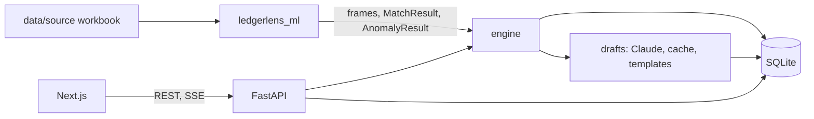

# 02 Architecture

## Components

| Component | Folder | Single responsibility |
|---|---|---|
| ML package | ml/ledgerlens_ml | read the workbook, generate GSTR-2B, normalise, score Matches, score Anomalies (ML_BUILD.md) |
| Engine | backend/app/engine | turn Records and scores into Matches, Findings, money; owns every GST rule |
| Store | backend/app/db.py plus SQLite file backend/data/ledgerlens.db | the only code that runs SQL |
| API | backend/app/main.py, backend/app/routes/*.py | HTTP and SSE; calls engine and store, serialises with pydantic |
| Drafts | backend/app/drafts | Claude calls, disk cache, templates, precache |
| Frontend | frontend/ | screens; talks only to the API |



```
workbook -> ml (load, augment, normalise, score) -> engine (rules, findings, money) -> sqlite -> api -> next.js
                                                        \-> drafts (claude or cache or template)
```

## Data flow: one Run

```mermaid
sequenceDiagram
  participant FE as Frontend
  participant API
  participant EN as Engine
  participant ML as ledgerlens_ml
  participant DB as SQLite
  FE->>API: POST /api/demo/load
  API->>ML: load_dataset() and augment if needed
  API->>DB: insert Records
  FE->>API: POST /api/runs {period: "2025-09"}
  API->>EN: start_run in a worker thread
  FE->>API: GET /api/runs/{id}/events (SSE)
  EN->>ML: score_pairs(booking, payment), score_anomalies
  EN->>EN: one-to-many, supplier filing, tax checks, duplicates, rule 37, rings
  EN->>DB: matches, findings, summary; run_events per stage
  API-->>FE: stage events, then done
  FE->>API: GET /api/runs/{id}/summary
  FE->>API: POST /api/findings/{fid}/draft, then POST /api/drafts/{did}/approve
```

## Interface contracts

All responses are pydantic models in backend/app/schemas.py. Money fields end in _paise and are integers. Dates are ISO strings. Errors: {"error": {"code": str, "message": str}} with 400, 404 or 409.

| Method | Path | Request | Response |
|---|---|---|---|
| GET | /api/health | | {status: "ok", model_version, dataset_loaded: bool, llm: "live" or "cache" or "template"} |
| POST | /api/demo/load | | {dataset_id, company: {name, gstin}, periods: ["2025-04", ...]} . Idempotent: returns the existing dataset if the hash matches |
| POST | /api/runs | {dataset_id, period} | {run_id, status: "queued"} . 409 if a Run for that period is already running |
| GET | /api/runs/{run_id}/events | | SSE, event "stage" data {stage, status: "started" or "done", message, at}; event "done" data {run_id}; event "failed" data {message} |
| GET | /api/runs/{run_id} | | {run_id, period, status, stage, started_at, finished_at} |
| GET | /api/runs/{run_id}/summary | | {period, itc_at_risk_paise, itc_found_paise, excess_tax_paise, net_payable_paise, match_counts: {auto, review, unmatched, one_to_many}, finding_counts_by_category: {..}, itc_at_risk_by_cause: [{finding_type, label, paise}], top_findings: [FindingRow x5]} |
| GET | /api/runs/{run_id}/findings | query: category, finding_type, status, impact_type, party_id, sort ("impact" default, "deadline"), page, page_size (default 50) | {items: [FindingRow], total} |
| GET | /api/findings/{finding_id} | | FindingDetail |
| GET | /api/runs/{run_id}/matches | query: kind, band, page | {items: [MatchRow], total} |
| GET | /api/matches/{match_id} | | {match: MatchRow, left: RecordView, right: [RecordView], diff: [FieldDiff]} |
| POST | /api/findings/{finding_id}/draft | | Draft (creates once, then returns the same) |
| PATCH | /api/drafts/{draft_id} | {body} | Draft |
| POST | /api/drafts/{draft_id}/approve | {note?: str} | {draft: Draft, finding: FindingRow, summary: Summary} . Finding status becomes approved |
| POST | /api/findings/{finding_id}/dismiss | {note: str} | {finding: FindingRow, summary: Summary} |
| GET | /api/runs/{run_id}/liability | | {by_tax_type: [{tax_type: "igst" or "cgst" or "sgst", output_paise, eligible_itc_paise, net_paise}], declared: {output_paise, itc_paise, net_paise, filed_on, due_on}, gap_paise, simplified_setoff: true} |
| GET | /api/runs/{run_id}/graph | | {nodes: [{id, label, kind: "company" or "supplier" or "customer", risk: "clean" or "ring" or "cancelled"}], edges: [{source, target, kind: "trade" or "same_pan" or "same_bank" or "same_address", label}], rings: [{id, members: [party_id], reason, itc_at_risk_paise, invoice_count}]} |
| GET | /api/eval | | {split: "test", rows: [{finding_type, planted, caught, false_alarms, catch_rate, false_alarm_rate, source: "engine" or "ml"}], generated_at} |

Shapes:

- FindingRow: {id, finding_type, label, category, severity, status, impact_type, impact_paise, confidence, deadline, party: {id, name}, title, record_refs: [{table, id}]}
- FindingDetail: FindingRow plus {reason, rule_ref, rule_text, what_to_do, evidence: {left: RecordView, right: RecordView or null, expected: {field: value} or null}, diff: [FieldDiff], match_id or null}
- FieldDiff: {field, label, left, right, expected, differs: bool}
- RecordView: {table, id, fields: {name: value}}
- MatchRow: {id, kind, invoice_id, right_ids, layer, confidence, band, reasons}
- Draft: {id, finding_id, kind, recipient, subject, body, source: "llm" or "cache" or "template", status}

## Stack decisions

| Choice | Alternatives | Why | Makes hard later |
|---|---|---|---|
| FastAPI | Flask, Next.js API routes | pydantic contracts, SSE support, same language as the engine | nothing material |
| SQLite via sqlite3, no ORM | Postgres, SQLAlchemy | one file, offline demo, zero setup; schema small and fixed | multi-user writes (out of scope) |
| Worker thread for Runs | Celery, asyncio tasks | one Run at a time, about 5 seconds; no broker | parallel Runs (not needed) |
| SSE for stages | WebSockets, polling | one-way, works through plain fetch in Next.js | none |
| Next.js App Router, client components for data screens | Vite SPA | the team's default, file routing, easy deploy | server components unused; fine |
| Cytoscape.js | react-force-graph, D3 | good layouts, styling per node, click events | none |
| Recharts | Nivo, Chart.js | simple React charts, enough for donut, bars, waterfall | none |
| Claude via anthropic SDK with disk cache | other providers | quality of plain-language drafts; cache makes demo offline | none |

Locked list: CLAUDE.md "Stack (locked)".

## File layout and seams

```
backend/
  requirements.txt
  app/
    main.py              FastAPI app, CORS, router includes, startup loads nothing heavy
    schemas.py           every request and response model
    db.py                connection, schema apply from plan/schema.sql copy, all queries
    routes/
      demo.py runs.py findings.py matches.py drafts.py liability.py graph.py eval.py health.py
    engine/
      run.py             orchestrates stages, writes run_events, catches failure into status failed
      records.py         loads Records from the ML Dataset into the store
      tax_rules.py       effective rate, tax type, arithmetic, exempt, zero, invalid GSTIN
      duplicates.py
      rule37.py          unpaid over 180 days, cancelled GSTIN
      supplier_filing.py purchase invoice to GSTR-2B baseline matching
      one_to_many.py     subset-sum on paise
      rings.py           networkx PAN, bank and address links, round trips
      findings.py        builds Finding rows: impact, severity, deadline, rule_ref, reason, what_to_do
      money.py           ITC at risk, ITC found, net payable, declared comparison
      labels.py          finding_type labels and rule texts (sentence case)
      evaluate.py        engine catch and false alarm rates against Ground truth
    drafts/
      llm.py             anthropic client, prompt hash cache in backend/cache
      templates.py       one template per draft kind
      precache.py        python -m app.drafts.precache --period 2025-09
  tests/
frontend/
  app/
    layout.tsx           shell: sidebar, top bar
    page.tsx             start
    dashboard/page.tsx  workbench/page.tsx  findings/[id]/page.tsx  graph/page.tsx
    liability/page.tsx  proof/page.tsx  suppliers/page.tsx  anomalies/page.tsx
  components/            KpiTile, StatusDonut, CauseBars, FindingTable, DiffView, DraftPanel,
                         RingGraph, StageStepper, Pill, BandBadge, EmptyState, ErrorState
  lib/
    api.ts               typed fetchers, one per endpoint; the only place that knows URLs
    format.ts            paise to "Rs 4,20,000", dates, percentages
    types.ts             mirrors schemas.py
    run-store.ts         current dataset_id and run_id (React context)
```

Seam rules:

- Only db.py runs SQL. Engine modules receive and return plain dataclasses or DataFrames; run.py persists. Reason: rules stay testable without a database.
- Only engine/ knows GST rules. Routes never compute money. Reason: one place to audit every number.
- Only drafts/llm.py talks to Anthropic. The engine never calls it; drafts read Findings from the store. Reason: Runs never wait on the network.
- Frontend never formats money outside lib/format.ts, never builds URLs outside lib/api.ts.

## External dependencies

| Dependency | Auth | Limits | Fallback |
|---|---|---|---|
| Anthropic API | ANTHROPIC_API_KEY | rate limits per account | cache on disk, templates; demo uses cache only |
| Google Fonts (Inter, League Spartan, JetBrains Mono) | none | none | self-host the TTFs in deck/fonts under frontend/public/fonts before the event |

Demo-safe rule: the demo machine needs no network. Fonts self-hosted, Drafts precached, dataset local.

## Environment variables

backend/.env (never committed):

- ANTHROPIC_API_KEY: optional; without it Drafts come from cache or templates.
- LLM_MODEL: default claude-sonnet-5-5.
- LLM_MODE: live, cache_only or template_only; demo uses cache_only.
- LEDGERLENS_DB: default backend/data/ledgerlens.db.
- CORS_ORIGIN: default http://localhost:3000.

frontend/.env.local:

- NEXT_PUBLIC_API_URL: default http://localhost:8000.
- NEXT_PUBLIC_DEMO: 1 shows the presenter next-step control.
