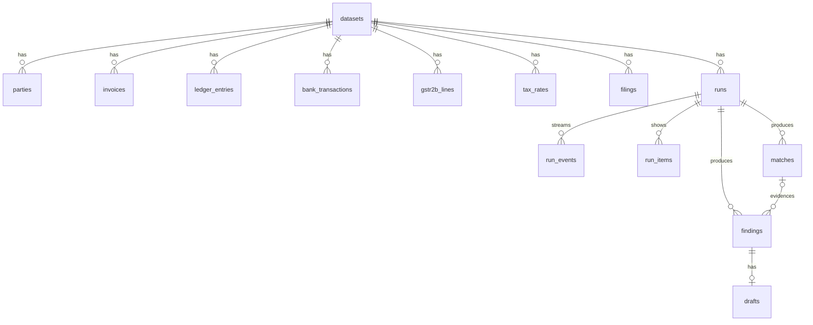

# 03 Data model

plan/schema.sql is the runnable schema and must stay in exact sync with this file. backend/app/db.py applies a copy of it at startup (backend/app/schema.sql, copied, not symlinked).

## Entities

## Tables

Records (loaded once per dataset from ledgerlens_ml.load_dataset plus augmentation): datasets, parties, invoices, ledger_entries, bank_transactions, gstr2b_lines, tax_rates, filings. Columns and types: schema.sql. Mapping from workbook: workbook enums lowercased (PURCHASE becomes purchase, DEBIT becomes debit, VENDOR becomes supplier); money times 100 rounded half up into _paise; period is the first 7 characters of the record date; filings joins tax_filings and answer_key on period (true_net_paise from true_net_tax_liability). parties.gstin_status, cancelled_from and PAN changes come from the augmentation manifest. bank_transactions.resolved_party_id comes from ledgerlens_ml resolve_bank.

Run outputs: runs, run_events, run_items (example records for the live feed), matches, findings, drafts, eval_results. A new Run for the same period deletes nothing; the frontend always shows the latest done Run per period.

Keys: every Record table has primary key (dataset_id, id), using workbook IDs. Run output tables use generated IDs: run_ followed by 8 lowercase hex, mat_, fnd_, drf_ likewise. findings.match_id is nullable (tax rule Findings have no Match). drafts.finding_id is unique: one Draft per Finding.

## Enums

### finding_type (category, default impact_type, severity)

| finding_type | Category | Impact type | Severity | UI label |
|---|---|---|---|---|
| AMOUNT_MISMATCH | matching | none | medium | Booked amount differs from invoice |
| DATE_MISMATCH | matching | none | low | Booked in a different period |
| INVOICE_ID_MISMATCH | matching | none | medium | Invoice number typed differently |
| PAYMENT_AMOUNT_MISMATCH | matching | unaccounted_payment | medium | Paid amount differs from invoice |
| PAYMENT_BEFORE_INVOICE | matching | none | medium | Paid before the invoice date |
| MISSING_LEDGER_ENTRY | missing | itc_at_risk for purchase, short_tax for sales | high | Invoice never booked |
| ORPHAN_LEDGER_ENTRY | missing | none | medium | Booking with no invoice |
| PAID_NOT_IN_BANK | missing | unaccounted_payment | high | Payment booked but not in bank |
| UNMATCHED_BANK_TXN | missing | unaccounted_payment | medium | Bank entry with no invoice |
| MISSING_IN_2B | missing | itc_at_risk | high | Supplier has not reported this invoice |
| MISSING_IN_BOOKS | missing | itc_found | medium | Credit in GSTR-2B not in your books |
| GSTR2B_VALUE_MISMATCH | missing | itc_at_risk | medium | Supplier reported a different amount |
| PERIOD_SHIFT | missing | none | low | Supplier reported in another month |
| DUPLICATE_INVOICE | duplicate | itc_at_risk for purchase, excess_tax for sales | high | Invoice entered twice |
| DUPLICATE_LEDGER_ENTRY | duplicate | itc_at_risk | high | Booked twice |
| DUPLICATE_PAYMENT | duplicate | unaccounted_payment | high | Paid twice |
| WRONG_TAX_RATE | tax | itc_at_risk for purchase, excess_tax or short_tax for sales | high | Wrong GST rate |
| WRONG_TAX_TYPE | tax | itc_at_risk for purchase, short_tax for sales | high | IGST and CGST plus SGST mixed up |
| TAX_CALC_ERROR | tax | itc_at_risk or short_tax | medium | Tax does not add up |
| EXEMPT_ITEM_TAXED | tax | excess_tax | medium | Tax charged on an exempt item |
| TAXABLE_ITEM_ZERO_TAX | tax | short_tax | high | No tax on a taxable item |
| INVALID_GSTIN | tax | itc_at_risk | high | GSTIN is not valid |
| CANCELLED_GSTIN | tax | itc_at_risk | critical | Supplier's GSTIN is cancelled |
| RULE_37_UNPAID_180 | tax | itc_at_risk | critical | Supplier unpaid for over 180 days |
| CIRCULAR_FLOW | anomaly | none | critical | Money went out and came back |
| OUTLIER_AMOUNT | anomaly | none | medium | Far larger than usual |
| ROUND_AMOUNT_SPIKE | anomaly | none | medium | Large round amount |
| THRESHOLD_SPLITTING | anomaly | none | high | Split to stay under the approval limit |
| VENDOR_BURST | anomaly | none | medium | Burst of small invoices |
| WEEKEND_LARGE_TXN | anomaly | none | low | Large invoice on a Sunday |
| PAN_LINKED_RING | anomaly | itc_at_risk | critical | Supplier and Customer share an owner |
| ITC_OVERCLAIM | filing | itc_at_risk | critical | More credit claimed than invoices support |
| ITC_ON_DUPLICATE_INVOICE | filing | itc_at_risk | high | Credit claimed on a duplicate invoice |
| UNDER_REPORTED_OUTPUT_TAX | filing | short_tax | critical | Return shows less tax than sales |
| TAX_SHORT_PAYMENT | filing | short_tax | critical | Paid less tax than the return says |
| LATE_FILING | filing | none | medium | Return filed late |

Engine finding_type values equal the workbook issue_type names where they exist, so evaluation joins on the name. Augmentation adds MISSING_IN_2B, MISSING_IN_BOOKS, GSTR2B_VALUE_MISMATCH, PERIOD_SHIFT, CANCELLED_GSTIN, RULE_37_UNPAID_180, PAN_LINKED_RING. V2 adds BLOCKED_CREDIT_17_5.

### Other enums

- findings.status: open (start), approved, dismissed. Approved and dismissed are terminal. Only a human action through the API changes it.
- drafts.status: draft (start), approved, dismissed; terminal as above. Approving a Draft approves its Finding in the same transaction.
- drafts.kind: supplier_email (MISSING_IN_2B, GSTR2B_VALUE_MISMATCH, CANCELLED_GSTIN), credit_note_request (purchase WRONG_TAX_RATE, DUPLICATE_INVOICE from a Supplier), customer_credit_note (sales WRONG_TAX_RATE, EXEMPT_ITEM_TAXED), journal_entry (everything else that changes the books, including RULE_37_UNPAID_180 reversal and MISSING_IN_BOOKS booking).
- runs.status: queued, running, done, failed. done and failed are terminal.
- runs.stage, in order: read, clean, match, check, anomalies, money, explain. UI labels: Reading records, Cleaning up, Matching, Checking tax, Looking for anomalies, Working out the money, Writing explanations.
- matches.kind: booking, payment, supplier_filing. matches.layer: exact, normalised, fuzzy, model, one_to_many. matches.band: auto (confidence at least 0.90), review (0.70 to 0.90), unmatched (below 0.70); thresholds live in config.

## Deadlines

findings.deadline, set by the engine: RULE_37_UNPAID_180 is invoice date plus 180 days; MISSING_IN_2B and GSTR2B_VALUE_MISMATCH use 30 November after the financial year end (Section 16(4) cut-off, verify wording in docs/RESEARCH.md); filing types use the return due date. Others null.

## Permissions

None. Single local user, no login (out of scope).

## Seed data

POST /api/demo/load loads data/source/tax_recon_dataset.xlsx and data/derived (generated by ledgerlens_ml augment, committed). Company: Sharma Traders Pvt Ltd, 07AAACS1234F1ZU. The demo needs September 2025 Run results and Drafts in backend/cache for every September Finding.
